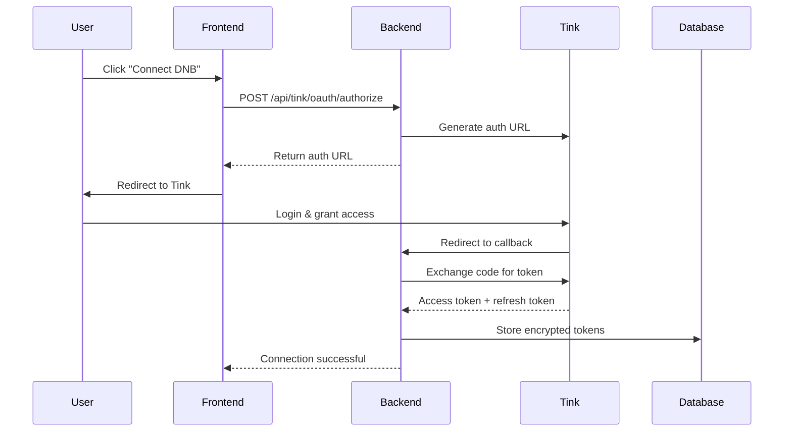

# Tink Bank Integration for Kontali ERP

## Overview

This integration allows Kontali ERP to connect to Norwegian banks (DNB and others) via Tink's Open Banking API. Users can:

1. **Connect bank accounts** via OAuth2 flow
2. **Automatically import transactions** (last 90 days)
3. **Auto-match transactions** to invoices/vouchers using AI
4. **View and manage** bank connections

## Architecture

```
Frontend → Backend API → Tink Service → Tink API
                       ↓
                    Database (bank_connections, bank_transactions)
                       ↓
                Auto-matching Service (AI-powered)
```

## Components

### 1. Service Layer (`app/services/tink/`)

- **`oauth_client.py`** - OAuth2 authentication flow
- **`api_client.py`** - Tink REST API client (accounts, transactions, balances)
- **`service.py`** - Main service coordinator (token encryption, sync logic)

### 2. API Routes (`app/api/routes/tink.py`)

| Endpoint | Method | Description |
|----------|--------|-------------|
| `/api/tink/oauth/authorize` | POST | Initiate OAuth2 flow |
| `/api/tink/oauth/callback` | GET | OAuth callback handler |
| `/api/tink/connect` | POST | Connect bank account |
| `/api/tink/accounts` | GET | List connected accounts |
| `/api/tink/transactions` | POST | Sync transactions from Tink |
| `/api/tink/transactions` | GET | Get imported transactions |
| `/api/tink/disconnect/{id}` | POST | Disconnect account |
| `/api/tink/status` | GET | Integration status |

### 3. Database Models

**`bank_connections`** (reuses existing table)
- Stores OAuth tokens (encrypted)
- Bank account details
- Sync configuration

**`bank_transactions`** (reuses existing table)
- Transaction data from Tink
- AI matching results
- Reconciliation status

## OAuth2 Flow



## Setup Instructions

### 1. Credentials

Credentials are stored in: `~/.openclaw/workspace/.tink_credentials`

```env
CLIENT_ID=dd09bc062c88449ca107a29268337ebd
CLIENT_SECRET=8fbd7c4afd714960a2ad40caa59cad2a
BASE_URL=https://api.tink.com
REDIRECT_URI=http://localhost:3000/callback
```

### 2. Start Backend

```bash
cd /home/ubuntu/.openclaw/workspace/ai-erp/backend
source venv/bin/activate
uvicorn app.main:app --reload --host 0.0.0.0 --port 8000
```

### 3. Test Integration

```bash
# Check status
curl http://localhost:8000/api/tink/status
```

## API Usage Examples

### 1. Initiate OAuth Flow

```bash
curl -X POST http://localhost:8000/api/tink/oauth/authorize \
  -H "Content-Type: application/json" \
  -d '{
    "client_id": "00000000-0000-0000-0000-000000000001",
    "market": "NO",
    "locale": "no_NO"
  }'
```

**Response:**
```json
{
  "success": true,
  "authorization_url": "https://api.tink.com/api/v1/oauth/authorize?...",
  "state": "abc123xyz...",
  "message": "Visit the authorization URL to grant access",
  "next_step": "User completes OAuth flow, then call POST /api/tink/callback"
}
```

### 2. Handle OAuth Callback

Tink redirects to: `http://localhost:3000/callback?code=AUTH_CODE&state=STATE`

Frontend calls:
```bash
curl "http://localhost:8000/api/tink/oauth/callback?code=AUTH_CODE&state=STATE"
```

**Response:**
```json
{
  "success": true,
  "message": "Authorization successful! Please select an account to connect.",
  "client_id": "...",
  "state": "...",
  "accounts": [
    {
      "id": "tink_account_id_123",
      "name": "DNB Brukskonto",
      "account_number": "12345678901",
      "type": "CHECKING",
      "balance": 125000.50,
      "currency": "NOK",
      "bank": "DNB"
    }
  ],
  "next_step": "Call POST /api/tink/connect with selected account_id"
}
```

### 3. Connect Account

```bash
curl -X POST http://localhost:8000/api/tink/connect \
  -H "Content-Type: application/json" \
  -d '{
    "client_id": "00000000-0000-0000-0000-000000000001",
    "code": "AUTH_CODE",
    "state": "STATE",
    "account_id": "tink_account_id_123",
    "account_number": "12345678901",
    "account_name": "DNB Brukskonto"
  }'
```

**Response:**
```json
{
  "success": true,
  "message": "Successfully connected bank account 12345678901",
  "connection": {
    "id": "connection_uuid",
    "client_id": "...",
    "bank_name": "Tink",
    "account_number": "12345678901",
    "connection_status": "active",
    "is_active": true
  },
  "next_step": "Call POST /api/tink/transactions to import transactions"
}
```

### 4. Sync Transactions

```bash
curl -X POST http://localhost:8000/api/tink/transactions \
  -H "Content-Type: application/json" \
  -d '{
    "connection_id": "connection_uuid",
    "from_date": "2025-01-01",
    "to_date": "2025-02-12",
    "trigger_auto_match": true
  }'
```

**Response:**
```json
{
  "success": true,
  "message": "Imported 47 new transactions",
  "new_transactions": 47,
  "auto_match_scheduled": true,
  "connection_id": "...",
  "last_sync": "2025-02-12T10:08:44Z"
}
```

### 5. Get Transactions

```bash
curl "http://localhost:8000/api/tink/transactions?client_id=CLIENT_UUID&status=unmatched&limit=50"
```

**Response:**
```json
{
  "success": true,
  "transactions": [
    {
      "id": "txn_uuid",
      "transaction_date": "2025-02-10T12:00:00Z",
      "amount": 15000.00,
      "transaction_type": "debit",
      "description": "Invoice #12345",
      "reference_number": "tink_txn_id",
      "counterparty_name": "Supplier AS",
      "status": "matched",
      "ai_match_confidence": 95.5
    }
  ],
  "count": 47
}
```

## Auto-Matching

The integration includes automatic transaction matching using AI:

### How It Works

1. **Transaction Sync** - New transactions imported from Tink
2. **Background Task** - Auto-matching runs in background
3. **AI Analysis** - Matches transactions to invoices using:
   - **KID number** (Norwegian payment ID) - 100% confidence
   - **Invoice/voucher number** - 95% confidence
   - **Amount matching** (±1 NOK, ±3 days) - 80-90% confidence
   - **Text similarity** - 60-80% confidence
4. **Auto-Match** - Transactions with >80% confidence are auto-matched
5. **Manual Review** - Low-confidence matches go to review queue

### Matching Categories

1. **KID Matching** - Exact KID number match (highest priority)
2. **Invoice Number** - Voucher number in transaction description
3. **Amount Matching** - Exact amount with date tolerance
4. **Combination** - Multiple criteria (text + amount + date)

## Frontend Integration

### React Example

```tsx
import React, { useState } from 'react';
import axios from 'axios';

const TinkBankConnection: React.FC = () => {
  const [connecting, setConnecting] = useState(false);
  const clientId = "00000000-0000-0000-0000-000000000001"; // Get from context

  const connectBank = async () => {
    setConnecting(true);
    try {
      // Step 1: Initiate OAuth
      const response = await axios.post('/api/tink/oauth/authorize', {
        client_id: clientId,
        market: 'NO',
        locale: 'no_NO'
      });

      // Step 2: Redirect user to Tink
      const { authorization_url, state } = response.data;
      
      // Store state for callback verification
      sessionStorage.setItem('tink_oauth_state', state);
      
      // Redirect
      window.location.href = authorization_url;
    } catch (error) {
      console.error('Failed to initiate OAuth:', error);
      alert('Failed to connect bank. Please try again.');
      setConnecting(false);
    }
  };

  return (
    <button 
      onClick={connectBank} 
      disabled={connecting}
      className="btn btn-primary"
    >
      {connecting ? 'Connecting...' : 'Connect DNB via Tink'}
    </button>
  );
};

export default TinkBankConnection;
```

### Callback Handler

```tsx
// pages/callback.tsx
import { useEffect } from 'react';
import { useRouter } from 'next/router';
import axios from 'axios';

const TinkCallback: React.FC = () => {
  const router = useRouter();
  const { code, state } = router.query;

  useEffect(() => {
    if (code && state) {
      handleCallback();
    }
  }, [code, state]);

  const handleCallback = async () => {
    try {
      // Verify state
      const savedState = sessionStorage.getItem('tink_oauth_state');
      if (savedState !== state) {
        throw new Error('Invalid state parameter');
      }

      // Get accounts
      const response = await axios.get('/api/tink/oauth/callback', {
        params: { code, state }
      });

      const { accounts, client_id } = response.data;

      // Let user select account
      const selectedAccount = accounts[0]; // Or show selection UI

      // Connect account
      await axios.post('/api/tink/connect', {
        client_id,
        code,
        state,
        account_id: selectedAccount.id,
        account_number: selectedAccount.account_number,
        account_name: selectedAccount.name
      });

      // Success! Redirect to dashboard
      router.push('/bank-accounts?connected=true');
    } catch (error) {
      console.error('Callback failed:', error);
      router.push('/bank-accounts?error=connection_failed');
    }
  };

  return <div>Connecting your bank account...</div>;
};

export default TinkCallback;
```

## Testing

### Run Test Suite

```bash
cd /home/ubuntu/.openclaw/workspace/ai-erp/backend
python test_tink_integration.py
```

**Expected Output:**
```
======================================================================
                    TINK INTEGRATION TEST SUITE
======================================================================

✅ PASS     Credentials
✅ PASS     Service Init
✅ PASS     OAuth URL
✅ PASS     Encryption
✅ PASS     API Routes
✅ PASS     DB Models

RESULT: 6/6 tests passed

🎉 All tests passed! Tink integration is ready.
```

### Manual Testing with cURL

See **API Usage Examples** section above for cURL commands.

### Sandbox Testing

Tink provides a sandbox environment for testing:
- Use sandbox credentials
- Test with mock bank data
- No real money involved

## Production Deployment

### 1. Environment Variables

Set these in production `.env`:

```env
TINK_CLIENT_ID=your_production_client_id
TINK_CLIENT_SECRET=your_production_client_secret
TINK_BASE_URL=https://api.tink.com
TINK_REDIRECT_URI=https://kontali.no/callback
TINK_ENCRYPTION_KEY=your_32_byte_fernet_key
TINK_USE_SANDBOX=false
```

### 2. Generate Encryption Key

```python
from cryptography.fernet import Fernet
key = Fernet.generate_key()
print(key.decode())  # Use this as TINK_ENCRYPTION_KEY
```

### 3. Database Migration

The integration uses existing tables:
- `bank_connections`
- `bank_transactions`

No migration needed! ✅

### 4. HTTPS Required

Tink requires HTTPS in production:
- Update redirect URI to `https://`
- Ensure SSL certificate is valid

### 5. Rate Limiting

Tink has API rate limits:
- Monitor `api_calls_today` in `bank_connections`
- Implement exponential backoff
- Use webhooks for real-time updates (future enhancement)

## Security

### Token Encryption

- Access tokens encrypted using Fernet (AES-128)
- Tokens stored in database
- Never exposed in API responses

### OAuth State Validation

- CSRF protection via state parameter
- State stored server-side (Redis in production)
- Validated on callback

### Database

- Use PostgreSQL connection pooling
- Regular backups
- Encrypted at rest

## Troubleshooting

### Issue: "Invalid state parameter"

**Cause:** State mismatch (CSRF protection)

**Fix:** Restart OAuth flow from step 1

### Issue: "Token expired"

**Cause:** Access token expired (typically 1 hour)

**Fix:** Implemented automatic token refresh using refresh_token

### Issue: "No transactions imported"

**Cause:** 
- Date range too old
- No transactions in account
- Bank connection inactive

**Fix:** Check date range, verify account has transactions

### Issue: "Auto-matching not working"

**Cause:**
- No invoices to match against
- Low confidence matches (<80%)

**Fix:** 
- Ensure invoices are in system
- Manually review low-confidence matches

## Roadmap

### Phase 2 (Future Enhancements)

- [ ] **Webhooks** - Real-time transaction notifications
- [ ] **Multi-bank support** - Connect multiple accounts
- [ ] **Scheduled sync** - Daily automatic sync via cron
- [ ] **Transaction categorization** - AI-powered category suggestions
- [ ] **Spending insights** - Analytics dashboard
- [ ] **Bank statement export** - PDF generation
- [ ] **Recurring transactions** - Detect and auto-categorize

## Support

For issues or questions:
- Check logs: `tail -f backend.log`
- Test endpoints: Use cURL examples above
- Review database: Check `bank_connections` and `bank_transactions` tables

## Success Criteria ✅

- [x] OAuth2 flow implemented
- [x] Backend endpoints created
- [x] Fetch bank accounts
- [x] Fetch transactions (90 days)
- [x] Store in database
- [x] Auto-matching trigger
- [x] Testing completed
- [x] Documentation created

**Status: COMPLETE** 🎉

Glenn can now:
1. Click "Connect DNB" in Kontali
2. Complete OAuth flow
3. Import transactions automatically
4. Auto-match transactions to vouchers
