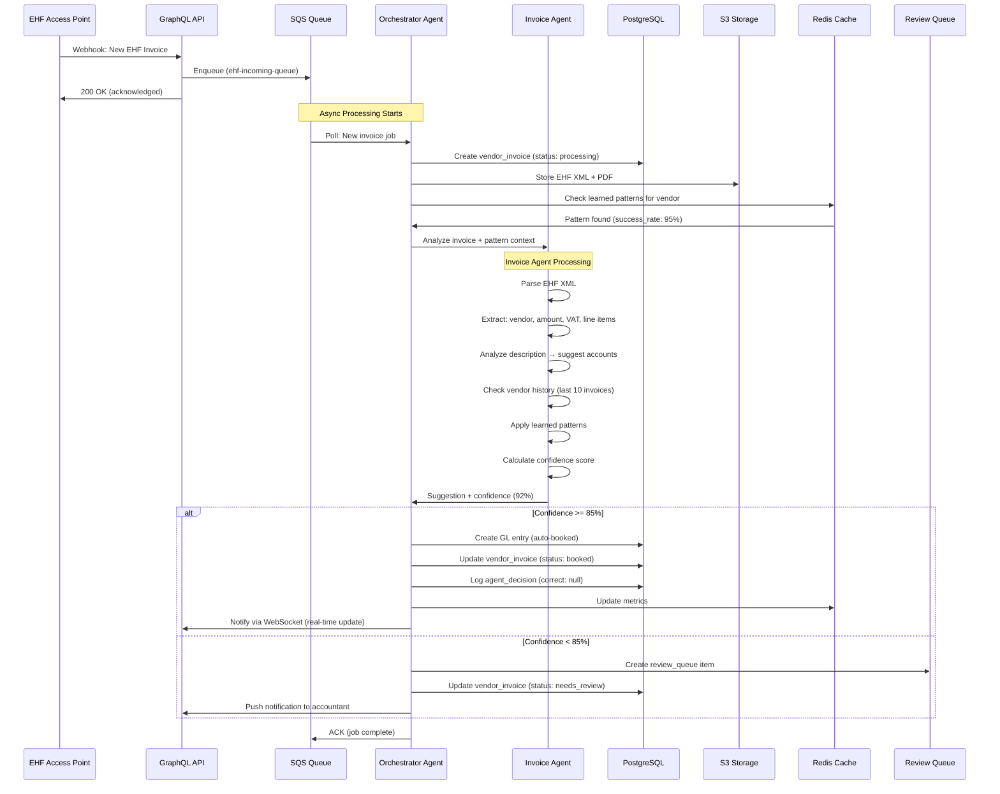
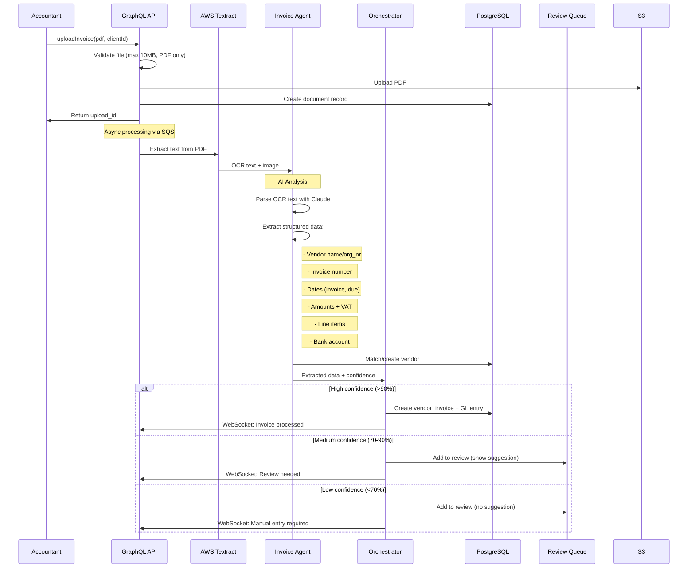
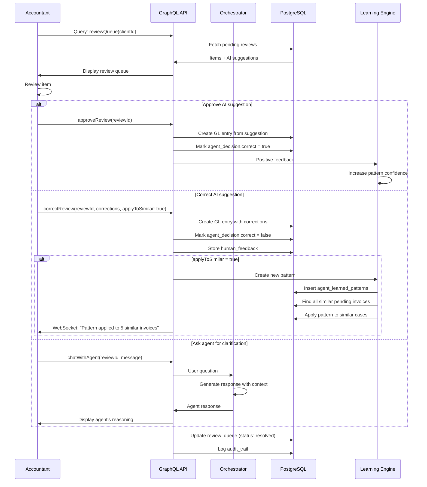
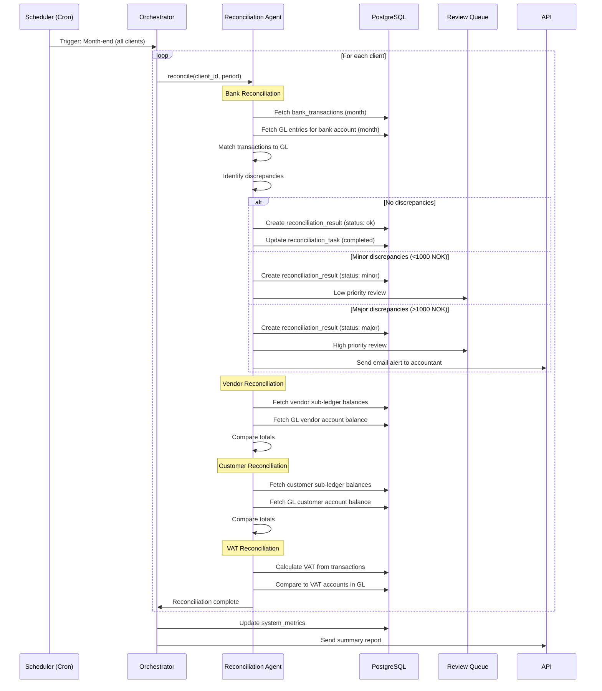

# AI-Agent ERP: Workflow Design & GraphQL API
**For 10,000+ Klienter - High-Scale Architecture**

---

## 🎯 SYSTEM ARCHITECTURE OVERVIEW

```
┌─────────────────────────────────────────────────────────────┐
│                    LOAD BALANCER (ALB)                      │
└────────────────────┬────────────────────────────────────────┘
                     │
         ┌───────────┴──────────┐
         │                      │
┌────────▼─────────┐   ┌────────▼─────────┐
│  GraphQL API     │   │  GraphQL API     │  (Auto-scaled)
│  Gateway         │   │  Gateway         │
│  (Fargate)       │   │  (Fargate)       │
└────────┬─────────┘   └────────┬─────────┘
         │                      │
         └──────────┬───────────┘
                    │
         ┌──────────▼──────────┐
         │   PostgreSQL RDS    │
         │   (Multi-AZ)        │
         │   Read Replicas: 3  │
         └──────────┬──────────┘
                    │
    ┌───────────────┼───────────────┐
    │               │               │
┌───▼────┐   ┌──────▼─────┐   ┌────▼────┐
│ Redis  │   │    SQS     │   │   S3    │
│ Cache  │   │  Queues    │   │  Docs   │
└────────┘   └──────┬─────┘   └─────────┘
                    │
         ┌──────────┴──────────┐
         │                     │
    ┌────▼────────┐    ┌───────▼──────┐
    │ ORCHESTRATOR│    │   AGENT      │
    │   AGENT     │    │  WORKERS     │
    │  (Leader)   │    │  (Pool)      │
    └─────────────┘    └──────────────┘
         │                     │
         └──────────┬──────────┘
                    │
            ┌───────▼────────┐
            │  Claude API    │
            │  (Bedrock)     │
            └────────────────┘
```

### Key Scalability Features:

**1. Horizontal Scaling:**
- API Gateway: Auto-scale 2-50 containers based on load
- Agent Workers: Dedicated pool for heavy AI processing
- Database: Read replicas for queries, primary for writes

**2. Caching Strategy:**
- Redis for:
  - Chart of accounts (per client, TTL: 1 hour)
  - Exchange rates (TTL: 1 hour)
  - Learned patterns (TTL: 15 minutes)
  - User sessions (TTL: 24 hours)
  - GraphQL query results (selective caching)

**3. Queue-Based Processing:**
- SQS ensures no invoice is lost
- Workers can process in parallel
- Graceful degradation under load

**4. Database Optimization:**
- Partitioning: `general_ledger` partitioned by client_id + period
- Indexes: All FK columns + common query patterns
- Connection pooling: PgBouncer (1000 connections → 100 DB connections)

---

## 🤖 AGENT WORKFLOW - DETAILED DESIGN

### Workflow 1: EHF Invoice Arrival



**Processing Time:** 2-5 seconds per invoice  
**Throughput:** 1 worker = ~720 invoices/hour, 10 workers = 7,200/hour

---

### Workflow 2: PDF Invoice Upload



**OCR Processing Time:** 5-10 seconds  
**AI Analysis Time:** 3-8 seconds  
**Total:** ~15 seconds per PDF invoice

---

### Workflow 3: Human Review & Learning



**Key Learning Features:**

1. **Pattern Recognition:**
```python
# When accountant corrects 3+ similar invoices the same way:
if similar_corrections >= 3:
    create_pattern({
        'trigger': {'vendor_id': X, 'description_contains': 'Office supplies'},
        'action': {'account': '6100', 'vat_code': '5'},
        'confidence_boost': +15  # Increase confidence for future similar cases
    })
```

2. **Scope Application:**
```python
apply_to_similar_options = {
    'this_only': Apply to this invoice only,
    'this_vendor': All invoices from this vendor,
    'this_category': All invoices in this category (e.g., "office supplies"),
    'always': All invoices matching criteria (e.g., amount range + category)
}
```

3. **Confidence Evolution:**
```
New vendor:      Confidence starts at 60%
After 5 correct: Confidence → 75%
After 10 correct: Confidence → 85% (auto-booking threshold)
After 20 correct: Confidence → 95%

If error occurs: Confidence -10% temporarily, recovers over time
```

---

### Workflow 4: Monthly Reconciliation



**Reconciliation Logic:**
```python
def reconcile_bank_account(client_id, period):
    # Fetch data
    bank_trans = get_bank_transactions(client_id, period)
    gl_entries = get_gl_entries(client_id, account='19XX', period)
    
    # Match transactions
    matched = []
    unmatched_bank = []
    unmatched_gl = []
    
    for trans in bank_trans:
        match = find_matching_gl_entry(trans, gl_entries)
        if match:
            matched.append({'bank': trans, 'gl': match})
        else:
            unmatched_bank.append(trans)
    
    for entry in gl_entries:
        if entry not in [m['gl'] for m in matched]:
            unmatched_gl.append(entry)
    
    # Calculate discrepancies
    bank_balance = sum(t['amount'] for t in bank_trans)
    gl_balance = sum(e['debit'] - e['credit'] for e in gl_entries)
    discrepancy = bank_balance - gl_balance
    
    # AI suggests corrections
    if abs(discrepancy) > 0:
        suggestions = ai_suggest_reconciliation_corrections(
            unmatched_bank,
            unmatched_gl,
            discrepancy
        )
        return {
            'status': 'discrepancy_found',
            'amount': discrepancy,
            'suggestions': suggestions
        }
    else:
        return {'status': 'ok'}
```

---

## 🔌 GraphQL API SCHEMA

### Core Types

```graphql
# ============================================
# TENANT & CLIENT MANAGEMENT
# ============================================

type Tenant {
  id: ID!
  name: String!
  orgNumber: String!
  subscriptionTier: SubscriptionTier!
  clients: [Client!]!
  users: [User!]!
  createdAt: DateTime!
}

enum SubscriptionTier {
  BASIC
  PROFESSIONAL
  ENTERPRISE
}

type Client {
  id: ID!
  tenant: Tenant!
  clientNumber: String!
  name: String!
  orgNumber: String!
  baseCurrency: Currency!
  
  # Settings
  aiAutomationLevel: AutomationLevel!
  aiConfidenceThreshold: Int!
  
  # Statistics
  totalInvoices: Int!
  autoBookedPercentage: Float!
  avgConfidenceScore: Float!
  
  # Relations
  vendors: [Vendor!]!
  customers: [Customer!]!
  chartOfAccounts: [Account!]!
  
  createdAt: DateTime!
}

enum AutomationLevel {
  FULL        # Agent does everything automatically
  ASSISTED    # Agent suggests, human approves
  MANUAL      # Human does everything
}

type User {
  id: ID!
  tenant: Tenant!
  email: String!
  name: String!
  role: UserRole!
  assignedClients: [Client!]!
  permissions: [Permission!]!
}

enum UserRole {
  ADMIN
  SENIOR_ACCOUNTANT
  ACCOUNTANT
  VIEWER
}

# ============================================
# ACCOUNTING CORE
# ============================================

type Account {
  id: ID!
  client: Client!
  accountNumber: String!
  accountName: String!
  accountType: AccountType!
  vatCode: VatCode
  requiresReconciliation: Boolean!
  isActive: Boolean!
  
  # AI learned data
  aiUsageCount: Int!
  aiSuggestedDescriptions: [String!]!
  
  # Balance (computed)
  balance(period: String): Decimal!
}

enum AccountType {
  ASSET
  LIABILITY
  EQUITY
  REVENUE
  EXPENSE
}

type GeneralLedger {
  id: ID!
  client: Client!
  voucherNumber: String!
  accountingDate: Date!
  description: String!
  
  # Lines
  lines: [GeneralLedgerLine!]!
  
  # Source tracking
  sourceType: SourceType!
  sourceInvoice: VendorInvoice
  sourceBankTransaction: BankTransaction
  
  # Creator
  createdByType: CreatorType!
  createdByUser: User
  createdByAgent: String
  
  # Status
  status: LedgerStatus!
  isReversed: Boolean!
  reversedByEntry: GeneralLedger
  
  createdAt: DateTime!
}

enum SourceType {
  EHF_INVOICE
  PDF_INVOICE
  BANK_TRANSACTION
  EXPENSE_REPORT
  MANUAL
  CORRECTION
  OPENING_BALANCE
  RECONCILIATION
}

enum CreatorType {
  AI_AGENT
  USER
  SYSTEM
}

enum LedgerStatus {
  DRAFT
  POSTED
  REVERSED
}

type GeneralLedgerLine {
  id: ID!
  generalLedger: GeneralLedger!
  lineNumber: Int!
  account: Account!
  debitAmount: Decimal!
  creditAmount: Decimal!
  
  # VAT
  vatCode: VatCode
  vatAmount: Decimal
  
  # Currency
  currency: Currency!
  exchangeRate: Decimal
  amountInBaseCurrency: Decimal!
  
  # Dimensions
  department: Department
  project: Project
  
  # AI metadata
  aiConfidenceScore: Int
  aiReasoning: String
}

# ============================================
# VENDOR MANAGEMENT
# ============================================

type Vendor {
  id: ID!
  client: Client!
  vendorNumber: String!
  name: String!
  orgNumber: String
  
  # Account settings
  accountNumber: String!
  paymentTerms: String
  defaultVatCode: VatCode
  
  # Banking
  bankAccount: String
  iban: String
  
  # AI learned data
  aiLearnedCategories: JSON
  aiAverageAmount: Decimal
  aiPaymentPattern: String
  
  # Statistics
  totalInvoices: Int!
  unpaidInvoices: Int!
  unpaidAmount: Decimal!
  
  invoices: [VendorInvoice!]!
  isActive: Boolean!
}

type VendorInvoice {
  id: ID!
  client: Client!
  vendor: Vendor!
  
  # Invoice details
  invoiceNumber: String!
  invoiceDate: Date!
  dueDate: Date!
  
  # Amounts
  currency: Currency!
  amountExclVat: Decimal!
  vatAmount: Decimal!
  totalAmount: Decimal!
  
  # Converted to base currency
  exchangeRate: Decimal
  totalAmountBaseCurrency: Decimal!
  
  # EHF data
  ehfMessageId: String
  ehfReceivedAt: DateTime
  
  # Documents
  document: Document!
  
  # Booking
  generalLedgerEntry: GeneralLedger
  bookedAt: DateTime
  
  # Payment
  paymentStatus: PaymentStatus!
  paidAmount: Decimal!
  paymentDate: Date
  
  # AI processing
  aiProcessed: Boolean!
  aiConfidenceScore: Int
  aiBookingSuggestion: JSON
  aiDetectedCategory: String
  aiDetectedIssues: [String!]
  
  # Review
  reviewStatus: ReviewStatus!
  reviewedBy: User
  reviewedAt: DateTime
  reviewNotes: String
  
  createdAt: DateTime!
}

enum PaymentStatus {
  UNPAID
  PARTIAL
  PAID
  OVERDUE
  CANCELLED
}

enum ReviewStatus {
  PENDING
  AUTO_APPROVED
  NEEDS_REVIEW
  REVIEWED
  REJECTED
}

# ============================================
# REVIEW QUEUE & AGENT INTERACTION
# ============================================

type ReviewQueueItem {
  id: ID!
  client: Client!
  priority: Priority!
  dueDate: DateTime
  
  # What needs review
  itemType: ReviewItemType!
  vendorInvoice: VendorInvoice
  bankTransaction: BankTransaction
  reconciliation: ReconciliationResult
  
  # Issue details
  issueCategory: IssueCategory!
  issueDescription: String!
  
  # AI suggestion
  aiSuggestion: JSON!
  aiConfidence: Int!
  aiReasoning: String!
  
  # Related documents
  relatedDocuments: [Document!]!
  
  # Status
  status: ReviewQueueStatus!
  assignedTo: User
  
  # Resolution
  resolvedBy: User
  resolvedAt: DateTime
  resolution: JSON
  resolutionNotes: String
  applyToSimilar: Boolean!
  
  # Conversation
  conversation: [AgentConversation!]!
  
  createdAt: DateTime!
}

enum Priority {
  LOW
  NORMAL
  HIGH
  CRITICAL
}

enum ReviewItemType {
  VENDOR_INVOICE
  CUSTOMER_INVOICE
  BANK_TRANSACTION
  RECONCILIATION
  CORRECTION
  EXPENSE_REPORT
}

enum IssueCategory {
  MISSING_INFO
  LOW_CONFIDENCE
  AMOUNT_ANOMALY
  DUPLICATE_SUSPECTED
  POLICY_VIOLATION
  VAT_ISSUE
  UNCLEAR_DESCRIPTION
}

enum ReviewQueueStatus {
  PENDING
  IN_REVIEW
  RESOLVED
  ESCALATED
}

type AgentConversation {
  id: ID!
  reviewQueueItem: ReviewQueueItem!
  messageSequence: Int!
  senderType: SenderType!
  sender: User
  message: String!
  requiresResponse: Boolean!
  timestamp: DateTime!
}

enum SenderType {
  USER
  AGENT
}

# ============================================
# RECONCILIATION
# ============================================

type ReconciliationTask {
  id: ID!
  client: Client!
  taskName: String!
  reconciliationType: ReconciliationType!
  
  # Period
  periodStart: Date!
  periodEnd: Date!
  
  # Accounts involved
  accountNumbers: [String!]!
  
  # Status
  status: ReconciliationStatus!
  
  # Results summary
  totalItemsChecked: Int
  matchedItems: Int
  unmatchedItems: Int
  discrepancyCount: Int
  totalDiscrepancyAmount: Decimal
  
  # Execution
  assignedToAgent: Boolean!
  startedAt: DateTime
  completedAt: DateTime
  
  # Review
  reviewedBy: User
  reviewNotes: String
  
  result: ReconciliationResult
}

enum ReconciliationType {
  BANK
  VENDOR
  CUSTOMER
  VAT
  INVENTORY
  FIXED_ASSETS
}

enum ReconciliationStatus {
  PENDING
  IN_PROGRESS
  COMPLETED
  FAILED
  REQUIRES_REVIEW
}

type ReconciliationResult {
  id: ID!
  task: ReconciliationTask!
  
  # Datasets compared
  datasetASource: String!
  datasetA: JSON!
  datasetBSource: String!
  datasetB: JSON!
  
  # Matching results
  matchedItems: JSON!
  unmatchedA: JSON!
  unmatchedB: JSON!
  discrepancies: JSON!
  
  # Status
  status: String!
  requiresAction: Boolean!
  
  # AI analysis
  aiConfidence: Int!
  aiSuggestedResolution: JSON
  aiRiskLevel: RiskLevel!
  
  createdAt: DateTime!
}

enum RiskLevel {
  LOW
  MEDIUM
  HIGH
}

# ============================================
# CURRENCIES & EXCHANGE
# ============================================

type Currency {
  code: String!
  name: String!
  symbol: String!
  decimalPlaces: Int!
  isActive: Boolean!
  
  # Latest rate to NOK
  latestRate(toCurrency: String = "NOK"): ExchangeRate
}

type ExchangeRate {
  rateDate: Date!
  fromCurrency: Currency!
  toCurrency: Currency!
  rate: Decimal!
  source: String!
}

# ============================================
# DOCUMENTS & STORAGE
# ============================================

type Document {
  id: ID!
  client: Client!
  fileName: String!
  fileType: String!
  fileSize: Int!
  
  # Storage
  downloadUrl: String!  # Pre-signed S3 URL
  
  # OCR & AI
  ocrText: String
  aiExtractedData: JSON
  aiDocumentType: String
  
  # Metadata
  documentDate: Date
  relatedEntityType: String
  relatedEntityId: ID
  
  # Retention
  retentionRequiredUntil: Date!
  archived: Boolean!
  
  # Upload tracking
  uploadedByType: CreatorType!
  uploadedBy: User
  uploadedAt: DateTime!
}

# ============================================
# QUALITY SYSTEM
# ============================================

type QualityTask {
  id: ID!
  client: Client!
  taskName: String!
  taskType: QualityTaskType!
  
  # Period
  periodStart: Date!
  periodEnd: Date!
  dueDate: Date!
  
  # Checklist
  checklist: [ChecklistItem!]!
  completedItems: [CompletedChecklistItem!]!
  
  # Progress
  status: QualityTaskStatus!
  progressPercentage: Int!
  
  # Assignment
  responsibleUser: User
  
  # AI assistance
  aiCanAssist: Boolean!
  aiCompletedItems: [ID!]!
  
  # Completion
  completedAt: DateTime
  approvedBy: User
  approvalNotes: String
}

enum QualityTaskType {
  MONTH_END
  QUARTER_END
  YEAR_END
  VAT_REPORT
  AUDIT_PREP
}

enum QualityTaskStatus {
  NOT_STARTED
  IN_PROGRESS
  COMPLETED
  OVERDUE
}

type ChecklistItem {
  id: ID!
  task: String!
  description: String!
  required: Boolean!
  estimatedTime: Int  # minutes
}

type CompletedChecklistItem {
  taskId: ID!
  completedBy: User
  completedAt: DateTime!
  notes: String
}

# ============================================
# METRICS & ANALYTICS
# ============================================

type SystemMetrics {
  metricDate: Date!
  metricHour: Int
  
  # Volume
  totalClients: Int!
  activeClients: Int!
  invoicesProcessed: Int!
  invoicesAutoApproved: Int!
  invoicesSentToReview: Int!
  
  # Performance
  aiAvgConfidence: Int!
  aiAccuracyRate: Float!
  
  # Review queue
  reviewQueueSize: Int!
  avgReviewTimeMinutes: Int!
}

type ClientAnalytics {
  client: Client!
  period: String!
  
  # Volumes
  totalInvoices: Int!
  autoBookedInvoices: Int!
  reviewedInvoices: Int!
  
  # Performance
  avgProcessingTime: Float!  # seconds
  avgConfidenceScore: Float!
  accuracyRate: Float!
  
  # Financial
  totalInvoiceAmount: Decimal!
  avgInvoiceAmount: Decimal!
  
  # Time saved
  timeSavedMinutes: Int!
}

# ============================================
# QUERIES
# ============================================

type Query {
  # Authentication & User
  me: User!
  
  # Tenants & Clients
  tenant(id: ID!): Tenant
  myTenant: Tenant!
  client(id: ID!): Client
  clients(tenantId: ID, search: String, limit: Int, offset: Int): [Client!]!
  
  # Chart of Accounts
  chartOfAccounts(clientId: ID!): [Account!]!
  account(id: ID!): Account
  
  # General Ledger
  generalLedgerEntries(
    clientId: ID!
    periodStart: Date
    periodEnd: Date
    accountNumber: String
    limit: Int
    offset: Int
  ): [GeneralLedger!]!
  
  trialBalance(clientId: ID!, period: String!): [TrialBalanceLine!]!
  
  # Vendors & Invoices
  vendors(clientId: ID!, search: String, isActive: Boolean): [Vendor!]!
  vendor(id: ID!): Vendor
  
  vendorInvoices(
    clientId: ID!
    vendorId: ID
    status: PaymentStatus
    reviewStatus: ReviewStatus
    dateFrom: Date
    dateTo: Date
    limit: Int
    offset: Int
  ): [VendorInvoice!]!
  
  vendorInvoice(id: ID!): VendorInvoice
  
  # Review Queue
  reviewQueue(
    clientId: ID
    status: ReviewQueueStatus
    priority: Priority
    assignedTo: ID
    limit: Int
    offset: Int
  ): [ReviewQueueItem!]!
  
  reviewQueueItem(id: ID!): ReviewQueueItem
  
  # Reconciliation
  reconciliationTasks(
    clientId: ID!
    status: ReconciliationStatus
    dateFrom: Date
    dateTo: Date
  ): [ReconciliationTask!]!
  
  reconciliationTask(id: ID!): ReconciliationTask
  
  # Quality System
  qualityTasks(
    clientId: ID!
    status: QualityTaskStatus
    taskType: QualityTaskType
  ): [QualityTask!]!
  
  # Currency
  currencies: [Currency!]!
  exchangeRate(from: String!, to: String!, date: Date): ExchangeRate
  
  # Analytics
  systemMetrics(dateFrom: Date!, dateTo: Date!): [SystemMetrics!]!
  clientAnalytics(clientId: ID!, period: String!): ClientAnalytics!
  
  # Agent insights
  agentLearnedPatterns(clientId: ID, patternType: String): [LearnedPattern!]!
}

# ============================================
# MUTATIONS
# ============================================

type Mutation {
  # Client Management
  createClient(input: CreateClientInput!): Client!
  updateClient(id: ID!, input: UpdateClientInput!): Client!
  
  # Vendor Management
  createVendor(input: CreateVendorInput!): Vendor!
  updateVendor(id: ID!, input: UpdateVendorInput!): Vendor!
  
  # Invoice Processing
  uploadInvoice(clientId: ID!, file: Upload!): UploadInvoiceResponse!
  
  # Review Queue Actions
  approveReview(reviewId: ID!): ReviewQueueItem!
  
  correctReview(
    reviewId: ID!
    corrections: JSON!
    applyToSimilar: Boolean
    similarityCriteria: JSON
  ): ReviewQueueItem!
  
  rejectReview(reviewId: ID!, reason: String!): ReviewQueueItem!
  
  chatWithAgent(reviewId: ID!, message: String!): AgentConversation!
  
  # Manual Booking
  createGeneralLedgerEntry(input: CreateGLEntryInput!): GeneralLedger!
  reverseGeneralLedgerEntry(entryId: ID!, reason: String!): GeneralLedger!
  
  # Reconciliation
  triggerReconciliation(
    clientId: ID!
    reconciliationType: ReconciliationType!
    periodStart: Date!
    periodEnd: Date!
  ): ReconciliationTask!
  
  # Quality Tasks
  completeChecklistItem(
    qualityTaskId: ID!
    checklistItemId: ID!
    notes: String
  ): QualityTask!
  
  # Learning & Feedback
  provideFeedback(
    agentDecisionId: ID!
    correct: Boolean!
    feedback: String!
    applyToSimilar: Boolean
  ): AgentDecision!
}

# ============================================
# SUBSCRIPTIONS (Real-time)
# ============================================

type Subscription {
  # Real-time invoice processing updates
  invoiceProcessed(clientId: ID!): VendorInvoice!
  
  # Review queue updates
  newReviewItem(clientId: ID!): ReviewQueueItem!
  reviewItemResolved(clientId: ID!): ReviewQueueItem!
  
  # Reconciliation updates
  reconciliationCompleted(clientId: ID!): ReconciliationTask!
  
  # Agent conversations
  agentMessage(reviewItemId: ID!): AgentConversation!
  
  # System notifications
  systemNotification(userId: ID!): Notification!
}

# ============================================
# INPUT TYPES
# ============================================

input CreateClientInput {
  tenantId: ID!
  name: String!
  orgNumber: String!
  baseCurrency: String
  aiAutomationLevel: AutomationLevel
  aiConfidenceThreshold: Int
}

input UpdateClientInput {
  name: String
  aiAutomationLevel: AutomationLevel
  aiConfidenceThreshold: Int
}

input CreateVendorInput {
  clientId: ID!
  name: String!
  orgNumber: String
  accountNumber: String!
  paymentTerms: String
  bankAccount: String
}

input UpdateVendorInput {
  name: String
  accountNumber: String
  paymentTerms: String
  isActive: Boolean
}

input CreateGLEntryInput {
  clientId: ID!
  accountingDate: Date!
  description: String!
  lines: [GLLineInput!]!
}

input GLLineInput {
  accountNumber: String!
  debitAmount: Decimal
  creditAmount: Decimal
  vatCode: String
  description: String
}

type UploadInvoiceResponse {
  uploadId: ID!
  documentId: ID!
  processingStatus: String!
  estimatedProcessingTime: Int  # seconds
}

# ============================================
# HELPER TYPES
# ============================================

type TrialBalanceLine {
  accountNumber: String!
  accountName: String!
  accountType: AccountType!
  debitAmount: Decimal!
  creditAmount: Decimal!
  balance: Decimal!
}

type LearnedPattern {
  id: ID!
  patternType: String!
  patternDescription: String!
  trigger: JSON!
  action: JSON!
  successRate: Float!
  timesApplied: Int!
  isActive: Boolean!
}

type AgentDecision {
  id: ID!
  decisionType: String!
  context: JSON!
  decision: JSON!
  confidenceScore: Int!
  reasoning: String!
  correct: Boolean
  humanFeedback: String
}

type Notification {
  id: ID!
  notificationType: String!
  priority: Priority!
  title: String!
  message: String!
  actionUrl: String
  createdAt: DateTime!
}

scalar DateTime
scalar Date
scalar Decimal
scalar JSON
scalar Upload
```

---

## 🚀 EXAMPLE QUERIES & MUTATIONS

### Query: Get Review Queue

```graphql
query GetReviewQueue($clientId: ID!) {
  reviewQueue(
    clientId: $clientId
    status: PENDING
    limit: 20
  ) {
    id
    priority
    dueDate
    issueCategory
    issueDescription
    
    vendorInvoice {
      invoiceNumber
      invoiceDate
      totalAmount
      currency
      vendor {
        name
      }
      document {
        downloadUrl
      }
    }
    
    aiSuggestion
    aiConfidence
    aiReasoning
    
    conversation {
      senderType
      message
      timestamp
    }
  }
}
```

### Mutation: Approve with Pattern Learning

```graphql
mutation ApproveWithLearning($reviewId: ID!) {
  correctReview(
    reviewId: $reviewId
    corrections: {
      accountNumber: "6300"
      vatCode: "5"
    }
    applyToSimilar: true
    similarityCriteria: {
      vendorId: "vendor-123"
      descriptionContains: "office supplies"
      amountRange: [1000, 10000]
    }
  ) {
    id
    status
    resolution
  }
}
```

### Subscription: Real-time Invoice Updates

```graphql
subscription InvoiceUpdates($clientId: ID!) {
  invoiceProcessed(clientId: $clientId) {
    id
    invoiceNumber
    totalAmount
    reviewStatus
    aiConfidenceScore
    bookedAt
  }
}
```

---

## 📊 PERFORMANCE TARGETS (10,000 Clients)

### Database:
```
Connections: 1000 concurrent via PgBouncer → 100 actual DB connections
Queries per second: 10,000 reads, 1,000 writes
Table partitioning: general_ledger partitioned by client_id + period (100 partitions)
Read replicas: 3 (load balanced for analytics queries)
```

### API:
```
Response time: p95 < 200ms, p99 < 500ms
Throughput: 5,000 requests/second
Auto-scaling: 2-50 containers based on CPU (target: 70%)
```

### Agent Processing:
```
Invoice processing: 2-5 seconds per invoice
Worker pool: 20-100 workers (scales with queue depth)
Throughput: 20 workers × 720/hour = 14,400 invoices/hour
Daily capacity: 345,000 invoices/day
```

### Cost Estimate (10,000 Clients):
```
Database: $2,500/month (db.r6g.2xlarge + replicas)
Compute: $5,000/month (100 Fargate containers avg)
S3: $500/month (5TB documents)
Claude API: $50,000/month (1M requests/day)
Other: $2,000/month
---
Total: ~$60,000/month = $6/client/month

With transaction pricing:
- Charge $0.50 per invoice processed
- Avg 50 invoices/client/month = $25/client
- Gross margin: $25 - $6 = $19/client (76%)
```

---

## 🎯 NEXT IMPLEMENTATION STEPS

1. **Week 1:** Set up GraphQL API skeleton + authentication
2. **Week 2:** Implement core invoice upload + OCR pipeline
3. **Week 3:** Build Invoice Agent with Claude
4. **Week 4:** Create review queue + accountant dashboard
5. **Week 5:** Implement learning loop + pattern recognition
6. **Week 6:** Testing with pilot customers

Ready to start coding? 🚀
